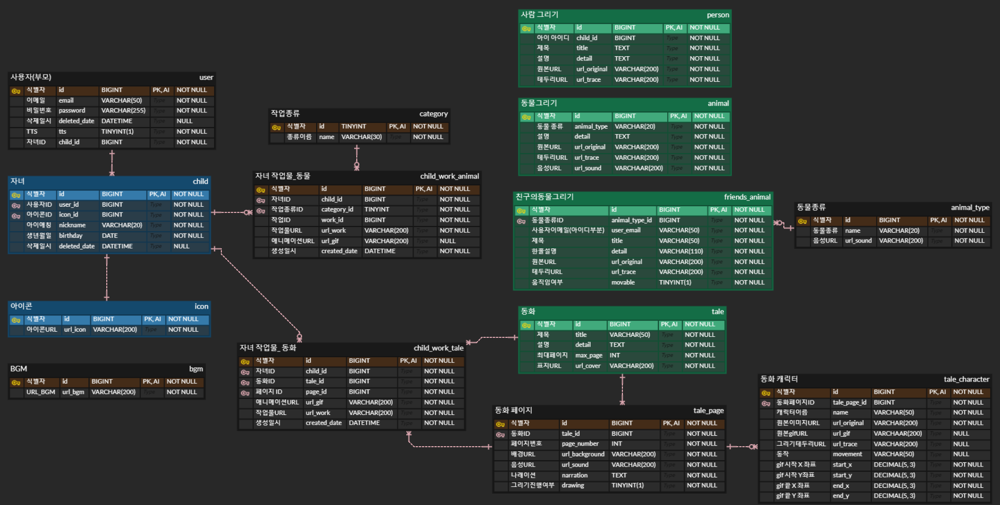

# 꼬마화가: 유아용 그림그리기 어플

## ✈ 개발 정보

> 개발 기간 : 2023.10.09 ~ 2023.11.17(총 7주)  
> 개발 인원 : 6명

## 📑 목차

1. [기획 배경](#기획-배경)
2. [주요 기능 설명](#주요-기능-설명)
3. [기술 스택](#기술-스택)
4. [아키텍처](#아키텍처)
5. [ERD](#erd)
6. [팀원 소개](#팀원-소개)

## 📌기획 배경

### 🎨 발달 과정의 유아들에게 '그리기' 행위는 아주 중요합니다.
선 긋기, 색칠하기와 같은 과정을 통해 소근육과 감각의 발달에 큰 영향을 미칩니다. 그리기의 중요성은 21세기 이전부터 여러 학자들이 '아동미술이론'을 정의함으로 그 중요성을 잘 알 수 있습니다.

### 🧩 부족한 유아용 그리기 어플리케이션
하지만 유아용 그리기 도구와 '따라 그리기 책' 같은 상품들은 다양하고 잘 준비되어 있지만, 유아용 그리기 어플리케이션은 선택지가 그렇게 많지 않습니다.
전문가용 그리기 툴이나 단순 그림 연습용 앱은 쉽게 찾아볼 수 있지만 아이들에게 흥미를 끌 만한 애니메이션이 적용된 앱은 수가 매우 적어서 다섯 손가락도 많을 정도이고
특히 국내에서 제작된 것은 없다시피 합니다.

### ✨ 내가 그린 것이 움직인다.
이런 부족함을 해소하고자 파이선 라이브러리를 적용하여 유아용 그리기 앱 '꼬마화가'를 만들었습니다. 꼬마화가는 아이가 그린 그림이 살아 움직입니다.
동물의 진짜 울음소리도 나오게 하여 동물에 대한 생생한 지식도 얻을 수 있고, 내가 그린 그림으로 진행되는 동화구연을 통해 이야기에 몰입할 수 있게 합니다.
생생한 체험과 그리기 활동으로 아이의 오감과 근육을 자극하는 교육성과 재미 두 마리 토끼를 모두 잡을 수 있는 앱을 만들었습니다.

## 🔎주요 기능 설명

### 💡 그리기, 색칠하기, 애니메이션 로직 

#### 1. 그리기 + 색칠하기

사용자가 동물, 사람 또는 동화를 선택하고, 테두리를 따라서 그립니다. 이때, 테두리 유사도가 80% 이상이 되었을 때 자동으로 색칠하기 페이지로 전환됩니다.
색칠하기 페이지에서는 그린 테두리 내부를 채색할 수 있으며, 테두리를 벗어나도 내부 영역을 추출하여 자유롭게 색칠할 수 있습니다.

#### 2. 애니메이션 효과 적용 
색칠을 완료하고 나면, 애니메이션 효과를 적용하여 움직이는 그림을 확인할 수 있습니다.
동물 그리기의 경우, 움직이는 그림을 누르면 해당 동물의 울음소리도 들을 수 있습니다.

 
#### <strong>🔆 동물 그리기</strong>
: '꼬마화가' 플랫폼에서 제공하는 다양한 동물들 중에서 하나를 선택한 후, `그리기+색칠하기+애니메이션` 로직을 진행하며 애니메이션이 나왔을 때 그림을 누르면 동물의 울음소리를 들을 수 있습니다.

#### <strong>🔆 동화 그리기</strong>
: '꼬마화가' 플랫폼에서 제공하는 다양한 동화 중에서 하나를 선택합니다. TTS(Text-to-Speech)를 사용해서 동화를 읽어주며 주요 인물이나 물건을 그리게 되어있습니다. 그리는 타이밍은 주인공이나 물건이 나오는 장면일 때 동화가 멈추면서 `그리기+색칠하기` 로직을 진행합니다. 색칠하기까지 완료하면 동화의 멈춘 시점부터 다시 읽어줍니다. 동화가 끝나면 아이가 그린 그림을 바탕으로 동화를 다시 볼 수 있습니다. 이때, 아이가 그린 그림이 애니메이션 효과를 적용한 상태로 움직이는 것을 볼 수 있습니다.

#### <strong>🔆 내 친구 그리기+올리기</strong>
: 사용자가 업로드한 사람 사진을 그려볼 수 있습니다. 업로드를 마치면 `그리기+색칠하기+애니메이션` 로직을 진행한 후, 움직이는 사람을 볼 수 있습니다. (그림은 사용자 본인만 열람할 수 있습니다.)

#### <strong>🔆 친구의 동물 그리기</strong>
: 자신이 올린 동물이나 다른 사용자가 올린 동물을 선택한 후, `그리기+색칠하기` 로직을 진행하면 동물의 내부 영역만 추출한 사진을 볼 수 있습니다.

#### <strong>🔆 내 동물 사진 올리기</strong>
: 자신의 애완동물이나 구글에서 검색한 동물을 올릴 수 있습니다. (다른 사용자도 이 그림을 보고 그려볼 수 있습니다.)

#### <strong>🔆 놀이방</strong>
: 다른 사용자들이 그린 동물 작품들을 랜덤으로 볼 수 있는 공간을 제공합니다.

 
 

| 동물 그리기 | 동화 그리기 |
|------------|------------|
|  |  |

 

| 친구 사진 올리기 | 친구 사진 그리기 |
|------------|------------|
|  |  |

 

| 동물 사진 검색해서 올리기&그리기 | 놀이방 |
|------------|------------|
||  |

 

## 📚기술 스택

<table>
<tr>
 <td align="center">언어</td>
 <td>
  
   
  
  
  
 </td>
</tr>
<tr>
 <td align="center">프레임워크</td>
 <td>
  
  
  
  
</tr>
<tr>
 <td align="center">라이브러리</td>
 <td>
  
  
  
  
  
  
  
  
  
  
  
  
  
  
    
    
  
    
</tr>
<tr>
 <td align="center">패키지 매니저</td>
 <td>
    
    

  </td>
</tr>
<tr>
 <td align="center">인프라</td>
 <td>
  
  
  
  
  
  
  
  
  
  
  
</tr>
<tr>
 <td align="center">포맷팅</td>
 <td>
   
   
  </td>
</tr>

<tr>
 <td align="center">협업툴</td>
 <td>
    
     
     
     
    
    
 </td>
</tr>
<tr>
 <td align="center">기타</td>
 <td>
    
     
    
     
 </td>
</tr>
</table>

## 🧱아키텍처
### - 전체 아키텍처

### - Auth, User Service
- 회원가입 및 이메일 인증번호 전송
- 로그인, JWT 발급
- 마이페이지, 회원 정보 관리 

### - Draw Service
- 모든 그리기 관련 로직 처리
- Detection, SimilarCheck, Animate, Image Service는 client와 직접 통신을 하지 않고 Draw Service와 서버간 통신

### - Image Service
- 사용자가 그린 그림과 애니메이션이 적용된 gif 파일을 S3에 업로드

### - Detection Service
- YOLOv5모델을 통한 객체 및 동물 종류 인식
- OpenCV를 활용한 배경 제거 및 테두리 검출

### - SimilarCheck Service
- 실시간 유사도 검사 
  - http : Draw Service에서 SimilarCheck Service로 테두리 원본 이미지와 사용자가 그린 테두리 이미지를 전송하여, 두 이미지 사이의 유사도 검사를 요청
  - web socket stomp : stomp를 통해 유사도 결과값, 커맨드를 프론트로 전송 

### - Animate Service
- 애니메이션 적용 : Animated Drawings를 활용하여 동물, 동화 속 주인공에 따른 설정파일을 적용하여 애니메이션 생성

## 🗂ERD

## 👬팀원 소개

| 이름   | 담당 기능 및 역할|
| ------ | --------------------------------------------------------------------------------------------------------|
| 정예진 | 팀장, 백엔드(orb 특징점 알고리즘을 사용하여 유사도 검증, stomp를 활용하여 테두리의 실시간 유사도 확인, contouring 및 kernel을 이용하여 사용자가 그린 작품의 테두리 내부 영역 추출, API: 전체 동물 조회, 선택한 동물 정보 조회, 동물/동화/사람 유사도 체크, 동물/동화/사람 내부 영역 추출, 작품의 GIF 결과 받아서 이미지 서버에 저장 요청), Figma 디자인, 기타 업무(자료 수집, 동화 데이터 그리기, 어린이집 시연 미팅, 최종 시연) |
| 김범기 | 팀원, 프론트 엔드(react-native 초기 세팅, Redux 및 react navigation적용, 그리기 기능, 색칠하기 기능, 동물 그리기 및 색칠하기, 동물 완성 페이지 구현, 내 친구의 동물 따라 그리기 및 색칠하기, 내 친구의 동물  완성 페이지 구현, 동화 따라 그리기 및 색칠하기, 동화 읽어주기 페이지 구현, 동화 기본 이미지 애니메이션 구현, 메인 페이지 구현, 각 그리기 탭 내 선택 페이지 구현)|
| 김소이 | 팀원, 백엔드(마이페이지 저장, 내 동물 사진 업로드, 마이페이지 저장 조회, 파일 AWS S3 업로드, 동화 로직 설계), Figma 디자인, 기타 업무(어린이집 시연 미팅, 최종 발표 자료 제작 및 발표)|
| 류성하 | 팀원, 프론트 엔드 (회원가입·로그인·비밀번호 찾기·마이페이지·놀이방·이미지 업로드 페이지 구현, 토큰 관리, 이미지 선택 기능 구현, BGM·TTS 구현)|
| 방진성 | 팀원, 백엔드(Gateway, Eureka, Spring Cloud Config, JWT/SpringSecurity 인증/USER 파트, jsoup을 이용한 이미지 크롤링, Google Custom Search API, yolo 모델을 활용한 객체 인식, OpenCV Contouring 배경 제거 및 테두리 검출,  Google Translate API), 프론트엔드(Lottie 라이브러리 애니메이션), 인프라(MSA 구조 설계, CloudFront 구현, 백엔드 도커 배포, 프론트엔드 APK 배포, Jenkins를 활용한 CI/CD, AWS RDS 관리)|
| 이대근 | 팀원, DB초기 설계, 백엔드(애니메이션 생성·수정·처리구조 설계(python), 이미지파일 전처리 튜닝(java, python), 머신러닝 도커 배포)|
